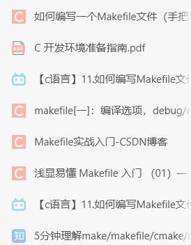
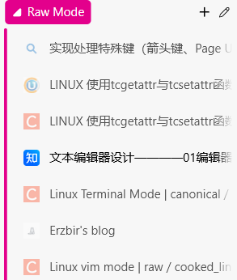
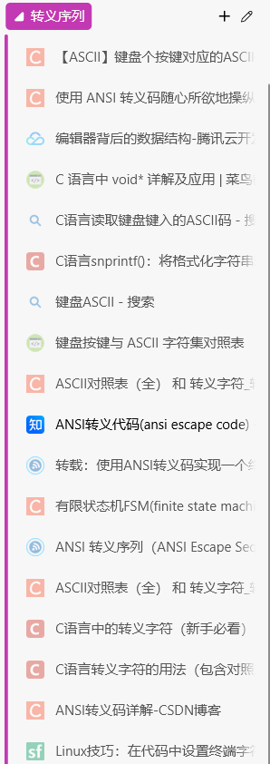

## 功能实现 

*   **终端原始模式 (Raw Mode)**: 禁用规范模式（canonical mode），实现按键即时响应。
*   **基本文本输入 (Basic Text Input)**: 支持输入可打印的 ASCII 字符。
*   **光标移动 (Cursor Movement)**: 支持使用方向键（上、下、左、右）移动光标。
*   **特殊按键处理 (Special Key Handling)**: 支持 Home, End, Page Up, Page Down 等功能键。
*   **退格功能 (Backspace)**: 支持使用退格键删除最后一个字符。
*   **清屏与重绘 (Screen Clearing & Redrawing)**: 每次按键后刷新屏幕以显示最新内容。
*   **安全退出 (Clean Exit)**: 按 `q` 键可退出编辑器，并恢复原始终端设置。

## 项目结构 (Project Structure)

```
.
├── main.c              # 程序主入口，初始化和清理
├── editor.c            # 负责启用和禁用终端原始模式
├── editor.h            # editor.c 的头文件
├── text_operations.c   # 编辑器的核心逻辑
├── text_operations.h   # text_operations.c 的头文件
└── Makefile            # 用于编译项目
```

## 编译与运行 (Compilation and Execution)
终端make即可
按 `q` 键退出。

## 工作原理 

### level0. makefile
参考资料：


### level1. 终端原始模式 

默认情况下，终端工作在“规范模式”下，输入会按行缓冲，直到用户按下回车键。为了实现一个实时响应的编辑器，我们必须进入“原始模式”。

`editor.c` 中的 `enableRawMode()` 函数使用 `termios` 结构体来修改终端属性：
- `ECHO`: 关闭回显，这样我们输入的字符不会自动显示在屏幕上。
- `ICANON`: 关闭规范模式，使输入可以按字符处理。
- `ISIG`: 禁用信号字符（如 `Ctrl+C`）。
- `IXON`, `ICRNL`: 禁用软件流控制和回车/换行符转换。

在程序退出时，`disableRawMode()` 会恢复终端的原始设置，确保终端不会被破坏。
参考资料：


### level2. 读取按键 

`text_operations.c` 中的 `read_key()` 函数负责从标准输入读取单个按键。这个函数比较特殊，因为它需要处理多字节的 **ANSI 转义序列**。

- 普通字符（如 'a', 'b', '1'）只占用一个字节。
- 特殊键（如方向键、Home、End）会以一个 `ESC` (ASCII 27) 字符开头，后面跟着几个字符。例如，向上箭头通常是 `\x1b[A`。`read_key()` 通过检查这些序列将它们映射到我自定义的 `KEY_UP`, `KEY_DOWN` 等枚举值。


程序的核心是 `text_op()` 函数中的一个 `while(1)` 循环。在每次循环中：
1.  **等待输入**: 调用 `read_key()` 等待用户按键。
2.  **处理输入**:
    *   如果是 `q`，则跳出循环。
    *   如果是普通字符，将其添加到缓冲区。
    *   如果是特殊键（如方向键），将其对应的 ANSI 光标控制序列添加到缓冲区。
    *   如果是退格，则在缓冲区中添加一个模拟退格的序列。
3.  **刷新屏幕**:
    *   使用 ANSI 转义序列 `\033[2J`（清屏）和 `\033[H`（光标归位）来清空整个屏幕。
    *   重新打印欢迎信息。
    *   将整个文本缓冲区的内容写入标准输出。
参考资料：



## 参考已有项目后发现的问题


这个项目是一个基础的演示，存在许多可以改进的地方：

*   **光标处理不正确**: 当前实现将光标移动的 ANSI 序列直接添加到了文本缓冲区。这只是在视觉上移动了光标，而不是在数据结构中真正管理光标位置。正确的方法是需要分别管理文本内容和光标的屏幕坐标。


